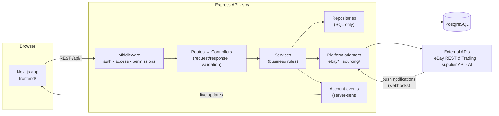
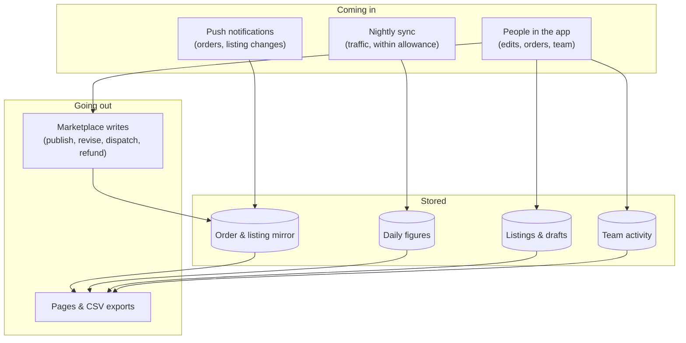

# Liston

A Node.js/Express API and a Next.js web app, backed by PostgreSQL. The two run
as separate processes from one repository and talk only over the REST API.

- **Backend** — `src/` · Express (CommonJS), raw SQL through `pg`, Zod validation, JWT auth
- **Frontend** — `frontend/` · Next.js (App Router), TypeScript, Tailwind
- **Database** — PostgreSQL, versioned SQL migrations in `src/db/migrations/`

---

## How it fits together



Every change follows the same one-way path: **route → controller → service →
repository**. Controllers only deal with the request and its validation,
services hold the rules, repositories only run SQL. Nothing outside
`src/modules/ebay/` and `src/modules/sourcing/` calls an external API.

### A request, step by step

1. The browser calls `/api/...` through `frontend/lib/api.ts`, the app's only HTTP client.
2. `requireAuth` checks the JWT and works out **who is acting** (`req.userId`) and **whose data it is** (`req.ownerId`). A team member acts on their owner's data.
3. `requireFeature` checks what that person may use on that account (per-feature, per-account permissions).
4. The controller validates the input (Zod) and calls a service.
5. The service reads and writes through repositories, and calls a platform adapter when it needs an outside system.
6. Errors are thrown with a `statusCode` and turned into a JSON response in one place (`errorHandler.middleware.js`).

---

## Where the data comes from and where it lives

| Data | Comes from | Stored in | Notes |
|---|---|---|---|
| Users, teams, permissions | sign-up, the Team page | `users`, `member_permissions` | removed members are deactivated, never deleted |
| Marketplace connections | OAuth | `connections` | tokens encrypted with AES-256-GCM (`credentials.encryption.js`), decrypted only for the call that needs them |
| Drafts and published records | the app's editor | `listings`, `listing_changes` | a live listing is edited as a working copy until it's published |
| Orders | marketplace push + periodic reads | `ebay_orders` (mirror), `order_sourcing`, `order_events` | the mirror is read by every page; nothing refetches per view |
| Traffic figures | nightly sync within the daily API allowance | `ebay_traffic_days`, `ebay_traffic_listing_reports` | every filter and range is added up from stored days |
| Who did what | every action taken in the app | `member_activity` | append-only; feeds each team member's page |
| Short-lived reads | external APIs | in memory (`swr-cache`) | refreshed in the background |

### How data moves



- **Reads are local.** Pages read from PostgreSQL and in-memory caches. External APIs are called on a schedule, on a push, or when someone explicitly asks, never once per page view.
- **Writes go out, then come back.** An action (publish, dispatch, refund…) is sent to the marketplace, recorded locally, and the change shows up in the mirror.
- **Every action has an author.** The person who did it is written to `member_activity`, which is what team figures are counted from.
- **Days follow the seller.** Dates are grouped in the marketplace's time zone, so every page agrees on what "today" means.

---

## Project layout

```
.
├── src/
│   ├── app.js, server.js         # Express app and entry point
│   ├── config/                   # environment → config
│   ├── db/
│   │   ├── migrations/           # NNN_name.up.sql / .down.sql
│   │   └── seeds/                # plans and platforms
│   ├── middleware/               # auth, access, permissions, errors
│   ├── modules/<feature>/        # *.routes → *.controller → *.service → *.repository
│   │   ├── ebay/api/             # one thin client per marketplace API
│   │   └── sourcing/             # supplier adapter
│   └── utils/                    # logger, encryption, email, validation messages
├── frontend/
│   ├── app/                      # pages (App Router), kept thin
│   ├── components/               # UI, grouped by area (orders/, analytics/, team/, charts/)
│   └── lib/                      # api.ts (the only API client), formatting, view state
├── scripts/                      # one-off operational scripts
└── tests/
    ├── unit/                     # pure logic
    └── integration/              # against a real local PostgreSQL
```

---

## Getting started

**Prerequisites:** Node.js 20+ and PostgreSQL 16.

### 1. Backend

```bash
npm install
cp .env.example .env        # fill in DATABASE_URL, JWT_SECRET, CREDENTIALS_ENCRYPTION_KEY, …
npm run migrate
npm run seed
npm run dev                 # http://localhost:3000
```

Generate an encryption key with:

```bash
node -e "console.log(require('crypto').randomBytes(32).toString('base64'))"
```

### 2. Frontend (a second terminal)

```bash
cd frontend
npm install
cp .env.local.example .env.local   # NEXT_PUBLIC_API_URL=http://localhost:3000
npm run dev -- -p 3001             # http://localhost:3001
```

---

## Commands

| Where | Command | What it does |
|---|---|---|
| root | `npm run dev` | API with auto-restart on changes |
| root | `npm start` | API in production mode |
| root | `npm run migrate` / `npm run migrate:down` | apply / roll back migrations |
| root | `npm run seed` | plans and platforms |
| root | `npm test` | unit + integration tests, then removes test data |
| frontend | `npm run dev` | web app in development |
| frontend | `npm run build` | type-check, lint and production build |

---

## Database changes

- Every schema change is a new pair: `src/db/migrations/NNN_name.up.sql` and `.down.sql`.
- An applied migration is never edited. Change it with a new one.
- Migrations run automatically on deploy, before the API starts.

## Tests

```bash
npm test
```

Unit tests cover pure logic. Integration tests run against a real local
PostgreSQL, with external APIs mocked at the client or service boundary.
Test users use `@example.com` addresses and are removed after each run.

The frontend is checked with `npm run build` (types and lint).

## Deployment

See [`DEPLOY.md`](DEPLOY.md): two services (API and web) plus PostgreSQL.
Migrations and seeds run as part of each deploy.

## Security

- `.env` files are never committed. `.env.example` lists every variable with placeholders.
- Marketplace credentials are encrypted at rest and never logged.
- Request bodies are never logged.
